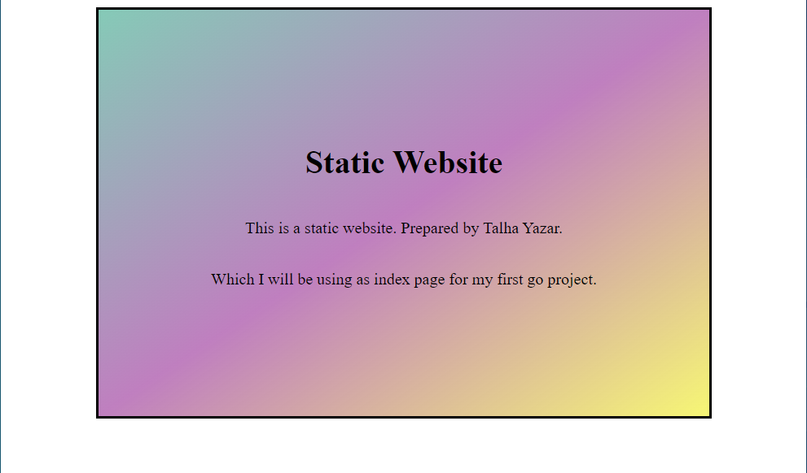
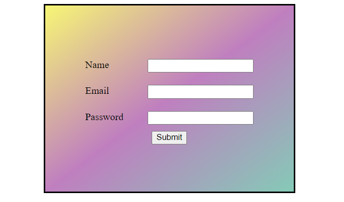

<h1>Welcome to my first Go Web Server Project Repo</h1>

In this Project I just recreated the first project of freeCodeCamp.org's video https://youtu.be/jFfo23yIWac.
  
And practice Go language to improve my knowledge about syntax and Web development practises.
  

  
Created 2 basic html page and handlers. We have 3 routes: 
<ol>
  <li>"/" Index Page</li>
  <li>"/hello" hello page (helloHandler)</li>
  <li>"/form.html" form page (after submit we're calling formHandler)</li>
</ol>
 

    
    

